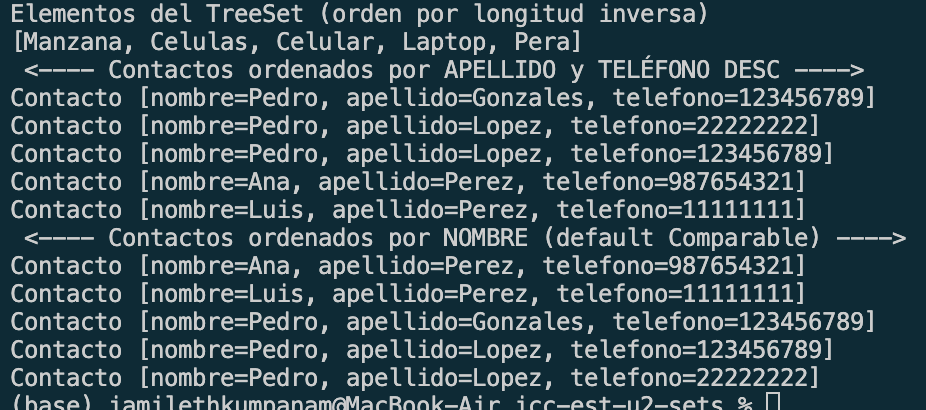
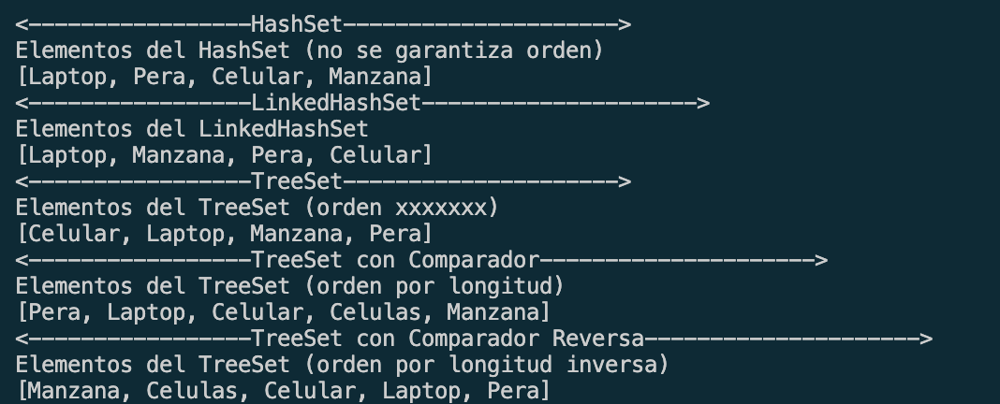

# Estructuras lineales

## 📌 Información General

•⁠  ⁠Título: SETS

•⁠  ⁠Asignatura: Estructura de Datos

•⁠  ⁠Carrera: Computación

•⁠  ⁠Estudiante: [Jamileth Estefanía Kumpanam Segarra]

•⁠  ⁠Fecha: [01/07/2025]

•⁠  ⁠Profesor: Ing. Pablo Torres

---
# 🌱 Ejercicios con `Set` en Java

Este proyecto contiene ejemplos prácticos del uso de diferentes tipos de `Set` en Java, incluyendo:

- `HashSet`
- `LinkedHashSet`
- `TreeSet`
- `TreeSet` con comparador personalizado (por longitud)
- `TreeSet` con comparador personalizado inverso (longitud descendente)

Todos los ejercicios utilizan los mismos datos y sirven para observar cómo cambia el comportamiento del conjunto según la implementación elegida.

---

## 📌 Datos de entrada

Se utilizan estas palabras para todos los ejemplos:

```java
"Laptop", "Manzana", "Pera", "Celular", "Laptop", "Pera", "Celulas"


### ✅ Ejemplo de salida:
[Celular, Pera, Laptop, Manzana]



